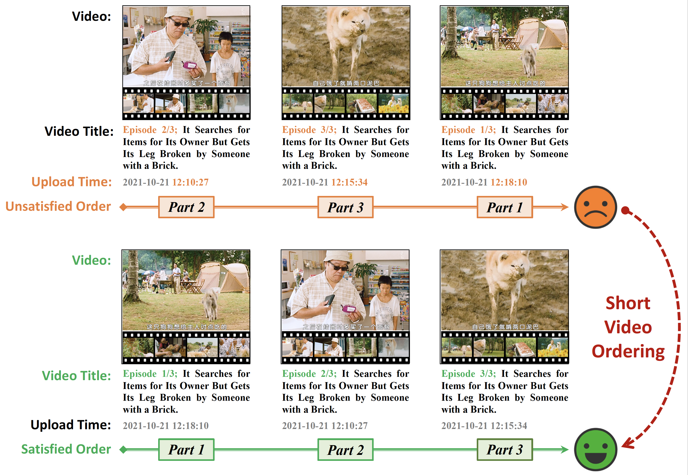

# SVO
Official Repository for the SIGIR 2024 paper: Short Video Ordering via Position Decoding and Successor Prediction.

The code and the dataset will be released soon after the paper is published officially.

## About
**Short video collection** is an easy way for users to consume coherent content on various online short video platforms, such as TikTok, YouTube, Douyin, and WeChat Channel. 
However, short video creators occasionally publish videos in a disorganized manner due to various reasons, such as revisions, secondary creations, deletions, and reissues, which often result in a poor browsing experience for users. 
Therefore, accurately reordering videos within a collection based on their content coherence is a vital task that can enhance user experience and presents an intriguing research problem in the field of video narrative reasoning. 
In this work, we curate a dedicated multimodal dataset for this Short Video Ordering (SVO) task and present the performance of some benchmark methods on the dataset. 
In addition, we further propose an advanced SVO framework with the aid of position decoding and successor prediction. Extensive experiments demonstrate that our method achieves the best performance on our open SVO dataset, and each component of the framework contributes to the final performance. 

    

## Dataset
TBD.

## License

<a rel="cc:attributionURL" href="https://github.com/ShipingGe/SVO">This work</a> is licensed under <a href="https://creativecommons.org/licenses/by-nc/4.0/?ref=chooser-v1" target="_blank" rel="license noopener noreferrer" style="display:inline-block;">CC BY-NC 4.0</a>

